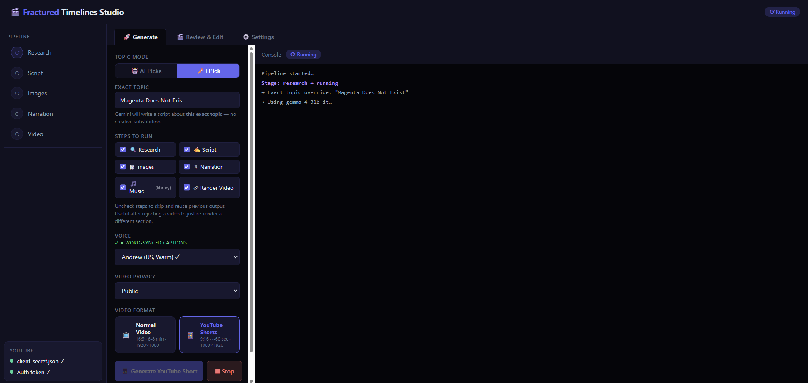
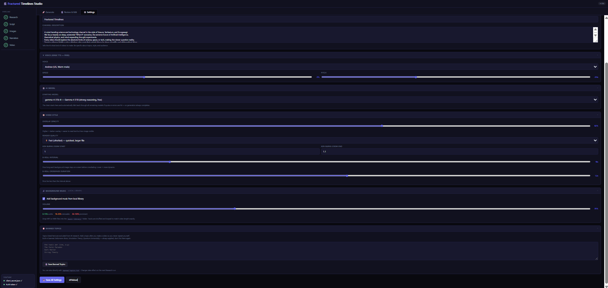
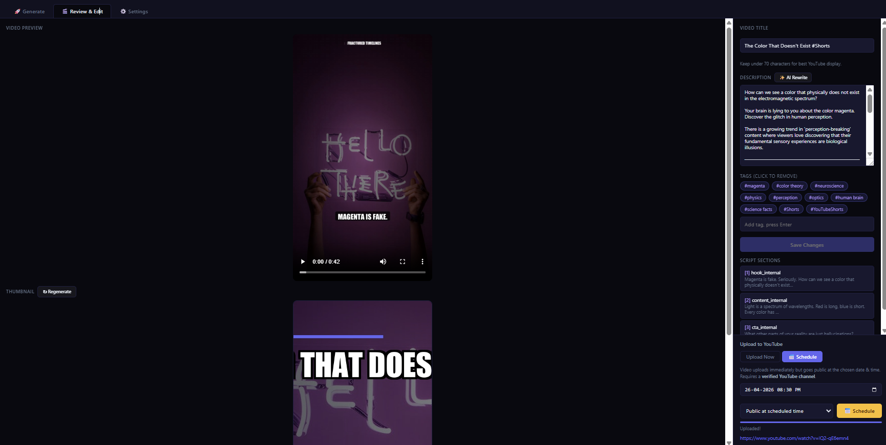

<div align="center">


# 🎬 YouTube AI Agent Studio

**A fully automated, 100% free AI pipeline that researches, scripts, narrates, animates, and uploads faceless YouTube videos — from a single command.**

[](https://python.org)
[](https://aistudio.google.com)
[](LICENSE)
[](SETUP.md)
[](https://github.com/raunakpatil/youtube-agentic-ai-studio/stargazers)

[**Quick Start**](#-quick-start) · [**Features**](#-features) · [**Pipeline**](#️-how-it-works) · [**Setup Guide**](SETUP.md) · [**FAQ**](#-faq)

</div>

---

## ✨ Features

| Feature | Details |
|---|---|
| 🧠 **AI Research** | Gemini scans for trending topics tailored to your channel niche |
| ✍️ **Script Writing** | Full narrated script with hook, sections, and CTA — in JSON |
| 🎙️ **Free Voice** | Microsoft Edge TTS (no API key, no cost, word-level timing) |
| 🖼️ **Stock Images** | Auto-downloads from Pexels with topic-aware search |
| 🎞️ **Animated Video** | Ken Burns zoom, smooth crossfades, captions, progress bars |
| 📱 **Shorts Support** | Generates vertical 9:16 Shorts alongside the main video |
| 🕵️ **Human Review** | Local web dashboard to watch and approve before publishing |
| 🚀 **Auto Upload** | Publishes to YouTube with SEO tags, description, and thumbnail |
| 🔄 **Smart Fallback** | 8-model chain auto-switches if any model hits quota |
| 🎵 **Background Music** | Drop MP3s in `music library/` — auto-looped to fit video length |

---

## 🖥️ Screenshots

| | |
|---|---|
|  |  |
| **Main dashboard** — generate videos with one click | **Settings panel** — configure every aspect |
|  |  |
| **Review dashboard** — watch before you publish | **Pipeline overview** |

---

## 🎬 Live Example — Built With This Tool

This repo powers **[Fractured Timelines](https://www.youtube.com/@TheFracturedTimelines)** — a real YouTube channel running entirely on this pipeline.

[](https://www.youtube.com/@TheFracturedTimelines)

> "What if Napoleon had nukes? What if Earth was flat... and spinning?"
> Every video on this channel was researched, scripted, narrated, and uploaded using exactly this code.

**[→ See what this tool can actually produce](https://www.youtube.com/@TheFracturedTimelines)**

---

## ⚡ Quick Start

```bash
# 1. Clone
git clone https://github.com/raunakpatil/youtube-agentic-ai-studio.git
cd youtube-agentic-ai-studio

# 2. Install dependencies
pip install -r requirements.txt

# 3. Set your API keys (copy and edit .env.example)
cp .env.example .env
# Edit .env and add your GEMINI_API_KEY and PEXELS_API_KEY

# 4. Run the GUI
python gui.py
# → Opens at http://localhost:7842

# — OR — run the pipeline directly from the terminal
python pipeline.py
```

> **First run?** Read the full [Setup Guide](SETUP.md) — it takes about 10 minutes.

---

## 🏗️ How It Works

The pipeline runs 6 sequential phases:

```
python pipeline.py  ──►  Research  ──►  Script  ──►  Narration
                                                          │
              YouTube ◄── Upload ◄── Review ◄── Video ◄──┘
```

| Phase | Agent | What it does |
|---|---|---|
| 1 · Research | `agents/researcher.py` | Gemini brainstorms trending topics for your niche and outputs a structured brief |
| 2 · Script | `agents/scriptwriter.py` | Expands the brief into a full narrated script with image queries per section |
| 3 · Narration | `video/narrator.py` | Edge-TTS converts the script to a cinematic MP3 voiceover |
| 4 · Images | `video/stock.py` | Downloads high-res stock photos from Pexels, topic-aware per section |
| 5 · Video | `video/creator.py` | Renders animated slides with Ken Burns, crossfades, captions, and music |
| 6 · Review | `review/app.py` | Spins up a local dashboard — you watch and approve before anything is published |
| 7 · Upload | `uploader/youtube.py` | Publishes to YouTube with full SEO metadata on your approval |

---

## 📁 Project Structure

```
youtube-ai-agent/
├── 📄 pipeline.py              ← Run this to start the full pipeline
├── 🖥️  gui.py                  ← Run this for the visual GUI
├── ⚙️  config.py               ← All settings: keys, colors, voice, video
├── 📦  requirements.txt
├── 🔑  client_secret.json      ← YouTube OAuth (you add yours — see SETUP.md)
├── 📝  .env.example            ← Copy to .env and fill in your API keys
│
├── agents/
│   ├── gemini_client.py        ← Shared AI client with 8-model fallback chain
│   ├── researcher.py           ← Topic research agent
│   └── scriptwriter.py        ← Script writing agent
│
├── video/
│   ├── narrator.py             ← Edge-TTS voiceover generator
│   ├── stock.py                ← Pexels image downloader
│   ├── creator.py              ← Full video renderer (Ken Burns, captions, etc.)
│   └── music.py                ← Background music mixer
│
├── review/
│   ├── app.py                  ← Flask review server
│   └── templates/review.html  ← Review dashboard UI
│
├── uploader/
│   └── youtube.py              ← YouTube Data API v3 upload
│
├── gui_templates/
│   └── index.html              ← Full GUI (served by gui.py)
│
├── music library/              ← Drop your MP3/WAV tracks here
│
└── output/                     ← Auto-generated (gitignored)
    ├── research.json
    ├── script.json
    ├── narration.mp3
    ├── images/
    └── final_video.mp4
```

---

## 🤖 AI Model Fallback Chain

The system automatically tries models in order, rotating from your **Starting Model** preference:

```
gemini-2.5-flash  →  gemini-2.5-flash-lite  →  gemma-4-31b-it
       ↓
gemini-2.0-flash  →  gemini-2.0-flash-lite  →  gemma-3-27b-it
       ↓
gemini-1.5-flash-001  →  gemini-1.5-pro-001
```

If a model hits quota (429) or is overloaded (503), it automatically retries up to 3 times then advances to the next model — **so your pipeline never stops mid-run.**

Set your preferred starting model in the GUI under **Settings → AI Model**, or in `config.py`:

```python
GEMINI_MODEL = "gemini-2.0-flash"   # 1500 free req/day — recommended default
```

---

## 🔑 API Keys Required

| Service | Key | Free Tier | Where to get it |
|---|---|---|---|
| **Google Gemini** | `GEMINI_API_KEY` | 1500 req/day | [aistudio.google.com](https://aistudio.google.com/apikey) |
| **Pexels** | `PEXELS_API_KEY` | 200 req/hour | [pexels.com/api](https://www.pexels.com/api/) |
| **Edge TTS** | *(none)* | Unlimited | Built-in |
| **YouTube API** | `client_secret.json` | Free | [Google Cloud Console](https://console.cloud.google.com) |
| **ElevenLabs** | `ELEVENLABS_API_KEY` | Optional | [elevenlabs.io](https://elevenlabs.io) |

> **Total cost: $0 per video.** All required services have free tiers that comfortably cover daily video production.

---

## 🎨 Customising Your Channel

Edit `config.py` to make the output yours:

```python
# 1. Describe your channel — the more specific, the better the topics
CHANNEL_DESCRIPTION = """
An educational channel covering the psychology of decision-making.
Target audience: adults 25-40 who enjoy Lex Fridman and Hidden Brain.
"""
CHANNEL_NAME = "Mind Mechanics"

# 2. Pick your voice
VOICE_ID = "en-GB-RyanNeural"   # British, deep, cinematic

# 3. Brand colours (RGB tuples)
COLORS = {
    "primary":   (99, 102, 241),   # your brand colour
    "highlight": (251, 191, 36),   # accent / titles
    ...
}

# 4. Video style
CROSSFADE_DURATION = 0.7   # image transition smoothness
OVERLAY_OPACITY    = 0.62  # how dark the image overlay is
```

---

## ❓ FAQ

<details>
<summary><b>Does this cost anything to run?</b></summary>

No. The entire stack uses free tiers:
- **Gemini** — 1500 req/day free on the 2.0-flash model
- **Pexels** — 200 req/hour free
- **Edge TTS** — completely free, no account needed
- **YouTube Data API** — free for uploads
- **Video rendering** — runs locally on your machine (CPU/GPU)

</details>

<details>
<summary><b>How long does one video take to generate?</b></summary>

On a mid-range machine (i7 + 16GB RAM):
- Research + Script: ~30 seconds
- Narration: ~10 seconds
- Image downloads: ~20 seconds
- Video render (10 min video): ~3–8 minutes depending on `RENDER_PRESET`
- Upload: ~2–5 minutes depending on internet speed

</details>

<details>
<summary><b>Can I use this without the YouTube upload?</b></summary>

Yes. The review step lets you click "Reject" to skip the upload — the rendered MP4 will still be saved in `output/`. You can also comment out the upload step in `pipeline.py` entirely.

</details>

<details>
<summary><b>Why is moviepy pinned to 1.0.3?</b></summary>

MoviePy v2.0 removed the `moviepy.editor` module and changed the entire API. v1.0.3 is required. Similarly, NumPy must be `<2.0.0` because MoviePy's underlying C extensions were compiled against NumPy 1.x. **Do not upgrade either.**

</details>

<details>
<summary><b>The video renders with tiny/ugly text</b></summary>

Your system is missing the fonts the renderer looks for. Install DejaVu fonts:
- **Ubuntu/Debian:** `sudo apt install fonts-dejavu`
- **Mac:** `brew install --cask font-dejavu-sans-mono-nerd-font`  
- **Windows:** fonts are already present in `C:/Windows/Fonts/`

</details>

<details>
<summary><b>YouTube upload fails with "access denied"</b></summary>

Delete `youtube_token.pickle` and re-run. This forces a fresh OAuth flow. Make sure your Google account is added as a **Test User** in Google Cloud Console → OAuth consent screen.

</details>

---

## 🗺️ Roadmap

- [ ] Thumbnail generator (AI-designed cover art)
- [ ] Scheduler (auto-post at peak times)
- [ ] Multi-channel support
- [ ] Custom intro/outro clips
- [ ] Analytics dashboard
- [ ] Voice cloning via ElevenLabs

---

## 🤝 Contributing

Pull requests are welcome! Please open an issue first to discuss major changes.

1. Fork the repo
2. Create a feature branch: `git checkout -b feature/my-feature`
3. Commit: `git commit -m 'Add my feature'`
4. Push: `git push origin feature/my-feature`
5. Open a Pull Request

---

## 🌍 Made With This Tool

**[Fractured Timelines](https://www.youtube.com/@TheFracturedTimelines)** — science, history, and "what if" scenarios.
Running 100% on this pipeline. Subscribe to see it in action.

---

## 📄 License

[MIT License](LICENSE) — free to use, modify, and distribute.

---

## ⭐ Support

If this project saves you time, please **star the repo** — it helps others find it.

[](https://github.com/raunakpatil/youtube-agentic-ai-studio)
